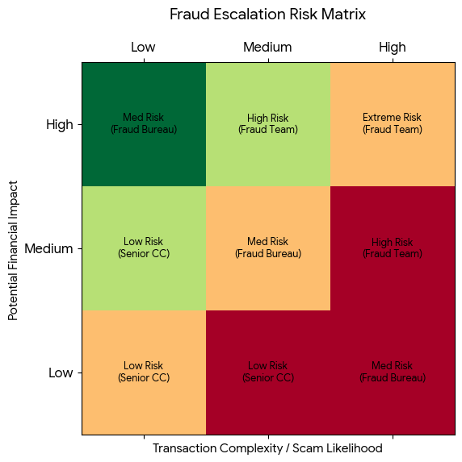

### **📂 Portfolio Artifact: Fraud Delegation & Risk Matrix**

**Objective:** To define clear risk thresholds that allow Senior Contact Centre staff to unblock low-risk transactions, thereby reducing operational bottlenecks and ensuring expert Fraud Analysts focus on high-impact threats.

---

#### **1. The Decision Support Matrix**

This table maps specific member scenarios to a **Risk Rating**, which then determines the **Action Authority**.

| Scenario Category | Member Behavior / Transaction Type | Risk Rating | Action Authority |
| --- | --- | --- | --- |
| **Operational Friction** | Block due to travel (e.g., card used in a new country without notification). | **Low** | **Senior CC Officer** (Immediate Unblock) |
| **Routine Unusual** | Small payment ($ < 500) to a new utility provider or local business. | **Low** | **Senior CC Officer** (Immediate Unblock) |
| **Behavioral Change** | Elderly member sending money to a "new friend" or relative they haven't paid before. | **Medium** | **Fraud Bureau** (External Verification) |
| **High Velocity** | Multiple "rapid-fire" Osko payments to different new payees in < 1 hour. | **High** | **Internal Fraud Team** (Expert Investigation) |
| **Sophisticated Attack** | High-value Crypto transfer or member mentions "loading software" (Remote Access indicator). | **Extreme** | **Internal Fraud Team** (Full Account Freeze) |

---

#### **2. Financial & Reputational Impact Levels**

To align with TMBL’s broader risk framework, we define the "Impact" levels used in the matrix above:

* **Low Impact:** Financial loss < $1,000; minimal reputational damage; service within Impact Tolerance.
* **Medium Impact:** Financial loss $1,000–$10,000; requires manual intervention; potential member complaint.
* **High Impact:** Financial loss > $10,000; potential APP scam; breach of **APRA CPS 230** Impact Tolerances.

---

#### **3. GRC Technical Analysis: "The Tuning Effect"**

In a Grade 4 role, you must think about how one control affects another.

By implementing this matrix:

* **Control Effectiveness:** We improve the "Speed to Resolution" for 80% of blocked members.
* **Residual Risk:** We accept a very small amount of residual risk (potential low-value fraud) in exchange for significant gains in **Operational Resilience**.
* **Capacity Planning:** We increase the "effective capacity" of the Fraud Team by roughly 30% by removing "noise" from their queue.

---

### **📊 Visualizing the Risk Landscape**

I have generated a visual matrix below that you can include in your project documentation. It plots **Transaction Sophistication** against **Potential Financial Loss**.
